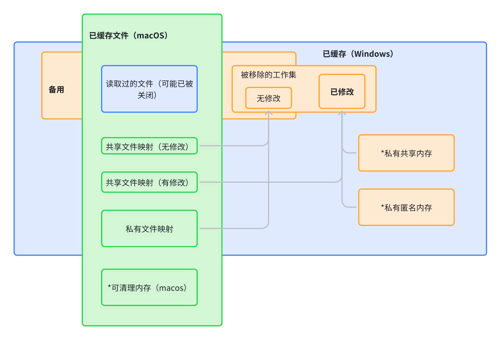

# 前言

进程和系统的内存指标很多，不同工具（任务管理器/活动监视器...）中的指标定义并不明确，不同操作系统存在名称相似但含义差异很大的术语。
本文抛砖引玉介绍现Windows & macOS 操作系统中的内存指标、概念，以便读者后续在使用软件分析、更进一步的内存文章阅读中有更清晰的认知。

# 摘要

- **进程内存**：关注进程被终止的时候，物理内存 和 page file 能释放的大小总和
  - Windows 上主要关注 private bytes（私有提交）、private workingset（私有物理内存），macOS 关注 footprint
  - 可以按照地址空间位置（数据段/代码段/heap/内存映射/stack），访问权限（私有/共享），页面位置（物理/交换），进行分类
  - Windows 上进程页面可按照提交状态（reserve / commtited / 工作集）分类
  - macOS 上进程内存可按照是否可丢弃（dirty/clean）进行分类
- **系统内存**：主要关注可用物理内存、总内存指标
  - Windows ：
    - 可用物理内存分为“备用”&“空闲”两部分，已使用物理内存包含“活跃”&“已修改”两部分
    - 提交和提交上限
      - Windows上存在commit limit限制，即允许进程暂时不分配内存，但承诺commit部分一定能成功分配到内存
      - 因此 Windows 的 oom 一般触发时机是 commit 申请过程，而其它操作系统触发时机一般是对申请内存进行读写（此时才会真正的分配内存）过程中
  - macOS 的可用物理内存（free）不包含“已缓存文件”，这部分内存可以在内存压力大的时候被移除，可折算入可用内存
		

# 基础概念

## **通用术语**

- **虚拟地址**：每个进程的虚拟地址空间大小是 2^X（X 是操作系统的位数）

- **虚拟内存**：在不同的环境下有不同的语义：
  - 虚拟内存技术（支持换页的内存管理方式）
  - 进程：
    - 进程虚拟地址空间（进程虚存）
    - 进程被换入到磁盘上的大小（已使用的交换空间）
    - 进程committed大小（private bytes 指标）
  - 系统：
    - 系统 pagefile （交换空间）
    - 系统 committed 大小（系统虚存）
> 尽量避免直接使用虚拟内存的概念，本文未特别说明下，虚拟内存术语为系统的交换空间大小。
- **交换空间**：操作系统通过换页将内存交换到磁盘上，其它等价术语有 pagefile，交换文件。

- **保护模式 & 实模式**：进程通过访问虚拟地址，由操作系统进行地址映射的方式是保护模式，直接操作物理地址方式是实模式。

- **文件映射**：文件映射将磁盘文件和内存地址映射起来，读写文件就好像是直接操作内存地址
> Note：文件映射和普通的 fread/fwrite 读写文件接口不同，是文件IO的一种方式

- **写时复制 (copy on write)**
  - （可读可写）私有的页面当被多个进程共享，内核把进程地址空间中这些内存页面标记为"*copy-on-write"*（页面数据库管理该信息）此时这些页面变成只读状态，*当*进程尝试对这块地址空间写入数据，会创建私有的匿名副本。
  - 具体场景：
    - fork 创建子进程，操作系统会将父进程的内存页映射到子进程的地址空间，但是初始时这些内存页是共享的，也就是只读的。当父进程或者子进程尝试去写这些内存页时，操作系统才会实际地为需要写入的内存页创建一个私有副本
    - mmap(fd, MAP_PRIVATE)，表示对于任何对映射区域的修改是私有的，也就是说这些修改不会反映回基础文件。当修改映射的内容的时候，会创建一个私有匿名内存副本

## 进程内存分类

### 按照地址空间的位置分类

- 代码段
	- TEXT 代码
- 数据段
	- READONLY_DATA 常量数据
	- DATA 静态数据（已初始化）
	- BSS 静态数据（未初始化）
- HEAP 堆（低到高）
- MEM_MAPPED 内存映射（低到高）
- STACK 栈（固定大小，高到低）
	

### 按照内容分类

- 共享 Sharable/Shared:
	- Mapped File：file-backup 共享文件映射（MEM_MAPPED）
	- Sharable Memory：memory-backup 匿名共享内存（MEM_MAPPED）
- 私有:
	- Heap：堆内存（HEAP）
	- Stack：栈内存（STACK）
	- Static：静态数据（DATA/BSS）
	- Process/Thread Environment Table（无法直接访问）
- Image（FrameWorks）：可执行文件（TEXT/READONLY_DATA/...）
- Page Table：内核维护的 当前进程页表（无法直接访问）
	

### 按照页面映射方式分类

- 匿名映射：虚拟地址不和特定的磁盘/设备文件关联
> 注意⚠️：匿名内存即使被换出到磁盘上仍然是匿名内存
- 文件映射 ：虚拟地址和特定磁盘/设备文件关联，通过虚拟地址可以直接读写文件

> 注意⚠️：读写过程中会使用到物理内存作为页面高速缓存来提高速度
> 文件读写和文件映射不是等价的概念

页面映射方式（匿名/文件映射）和页面访问权限（私有/共享）四象限：

- Private 私有（专用）内存	
    - **Anonymous 匿名映射 (#1)**
        - stack 栈
        - Static：静态数据（DATA/BSS）
        - malloc c标准库接口：动态内存申请方式
            - malloc只能用来分配匿名私有内存，会根据申请内存大小决定具体的内存申请方式
            - macos/linux: sbrk/ brk 在 heap 上申请内存（brk 是调整堆的结尾增加/减少从而线性大小改变）
            - 注意⚠️：这里的堆是操作系统中进程地址空间中的概念，和广义的动态内存分配在“堆”上，不是同一个概念，广义的“堆”指的是全部的动态内存的区域(包括mmap分配的内存区域)。
            - windows：HeapAlloc
        - 平台接口
            - macos/linux：mmap(MAP_SHARED, MAP_ANONYMOUS)，mmap 可以进行文件映射或者是匿名内存映射，也可以是申请私有或者共享，这里是匿名私有映射
            - windows：VirtualAlloc / CreateFileMapping+MapViewOfFile，CreateFileMapping 也可以创建匿名映射
    - **file-backed 文件映射	 #3**
        - macos/Linux：mmap(PRIVATE, fd)
        - Windows：CreateFileMapping+MapViewOfFile
- Shared 共享内存  
    - **Anonymous 匿名映射 #2**
        - macos/linux：
            - POSIX shm*（这个星号表示以 shm 为前缀的函数，如 shm_open shmat shmctl shmdt shmget ）
            - mmap(MAP_SHARED, MAP_ANONYMOUS)
        - windows: VirtualAlloc
    - **file-backed 文件映射	#4**
        - macos/linux：mmap(SHARED, fd)
        - Windows：CreateFileMapping+MapViewOfFile
        - 可执行文件 ：Image（FrameWorks）：可执行文件（TEXT/READONLY_DATA/...）

    
### 按照页面映射位置分类

- 物理内存
- 交换空间
	
**页面映射位置（物理/交换）和页面访问类型（私有/共享）四象限:** 

# 进程内存
## Windows
### 指标

> 工具：[vmmap](https://learn.microsoft.com/zh-cn/sysinternals/downloads/vmmap)、任务管理器、资源监视器、[Process Explorer](https://learn.microsoft.com/en-us/sysinternals/downloads/process-explorer)、[Process Hacker](https://systeminformer.sourceforge.io/downloads)

Windows 引入了“工作集”概念来表示进程虚拟地址空间映射的物理内存（不包含交换到磁盘部分即 page file）的大小
> 在 macOS 仍然被命名为进程的物理内存，在 Linux 上则使用“resident size” 驻留集术语。

Windows 上进程地址空间有“Reserve 保留”和“Commit 提交”两个重要概念。

- “Reserve”仅分配虚拟地址空间，系统不关心大小。
- “Commit”成功不代表已分配物理内存，只表示最终要用，且只要成功，系统承诺需要时能映射到物理内存（通过 commit limit 和 committed 保证）。
	

> 在 macOS/Linux 上无完全一致的概念对应，是因为不同操作系统的内存管理有区别，比如 macOS 上交换空间是整个磁盘区域，Linux 上允许通过 vm.overcommit_memory 来过度承诺 commit。这也是为什么会在Windows上会出现物理内存充足但是oom情况

> 举个例子，你需要办事预定酒席，可能需要 100 个餐位，但目前确定的人数只有 50 个人，你在自己的小本子上记上可能预定 100 个餐位，打电话给老板的时候只说你暂时只预定 50 个餐位。那这 100 个餐位就是 reserve 的大小，只占据了进程的虚拟地址空间，其中已经确定的 50 个餐位就是 committed 部分。其中 committed 成功后，人并不一定到餐馆了。

下图是不同软件的指标对应关系：

- **虚拟地址已经使用的大小**: 进程申请的虚拟地址空间大小 = Reserve（保留但未提交） + Commited。
- **已提交 committed**: 进程地址空间的一种状态，表示系统承诺这部分地址空间可以映射到物理内存上。
  > 注意⚠️：在 Windows 任务管理器上的“已提交”不包含共享部分，即值为 private bytes 的值。
- **私有提交 private bytes**: 私有的已提交部分。
  > ⚠️注意：该指标包含未被分配内存的部分，因此不是私有工作集+私有交换到磁盘部分之和。
- **总工作集 Total WS**: #4 专用物理内存 + #7 共享的物理内存。
- **私有工作集 private workingset**: 私有的物理内存。
  > 注意⚠️：在任务管理器默认看到的是这个指标。
- **可共享工作集**: 支持多个进程共享访问的物理内存。
- **已共享工作集**: 已共享工作集是"实际已被共享"的内存，即这部分内存已被多个进程占用。

### 细节

windows 进程指标分为工作集（总/共享/私有）和提交（私有/总）两部分，比较清晰，同时活动监视器指标和api接口返回值一致（不像macOS上的dirty/clean的概念就相对复杂）
- 已提交：可能未分配内存
- 工作集：包含所有物理内存，不管是私有、共享、匿名还是文件映射

## macOS

### 指标

macOS 在已有的“共享/私有”，“物理/交换”进程内存分类上，根据“是否可丢弃”增加一个新的维度：dirty/clean：

- clean：这部分内容随时被++丢弃++后续再通过 page fault 重新读取文件
	- mmap 文件映射
	- malloc 申请但还未分配的内存
	- 代码文件中的__TEXT、__DATA_CONST 区域
- dirty：这部分内容不能直接丢弃，而只能交换到磁盘或者被压缩。匿名内存
	- All heap Allocations 在堆上分配的内存（malloc / array / NSCache/ String...)
	- Framework 的__DATA 和 __DATA_DIRTY 部分

> 注意⚠️：未特别说明情况下，dirty 不包含 dirty compressed（即内存压缩以及被换出到磁盘的部分）（vmmap 中的定义），而广义的 dirty 和 footprint 概念“接近”。
> dirty 的概念有点类似 Windows 上的“已修改”，但完全不一样。Windows 上的“已修改”是系统内存中的概念（队列），表示的是从进程中移除的工作集，并且这部分工作集内容是“dirty”的。

1.  **内存（footprint 指标）**: `internal + internal_compressed` + iokit 持有的内存 + purgeable_nonvolatile 内存 + 页表
    * Physical footprint: This is the sum of: + (internal（匿名内存） - alternate_accounting（iokit_mappiing 中dirty 部分）) + (internal_compressed（匿名内存被压缩或者被交换） - alternate_accounting_compressed（iokit_mappiing 中dirty 且被压缩或被交换的部分）) + iokit_mapped（IOKit持有的内存，一般和设备访问、图像处理等有关，和文件映射不是一个概念） + purgeable_nonvolatile（可清理且非易失内存物理内存） + purgeable_nonvolatile_compressed（可清理且非易失内存被压缩或被交换） + page_table
    * 可以看到 footprint 概念和广义的 dirty 概念接近，但footprint 除了私有匿名内存以外，还额外有：匿名共享内存、purgeable_nonvolatile、iokit_mapped
    * Note：不包含文件映射的内容
    * **注意⚠️：活动监视器中默认内存是该指标**
    * Note：macos上malloc 分配的内存是不可清理类型，与此相对应的有一类是可清理内存，通过特定接口申请，一般用于缓存的场景，可以被清理，其中非易失类型只在内存压力非常大的时候才会被清理
2.  **实际（物理）内存** (Real Memory / RSIZE): 占用的物理内存，包含私有和共享两部分
    * NOTE：不包含被交换到磁盘的部分
    * *不包含被压缩部分
3.  **专用（物理）内存** (Real Private Memory / RPRVT): 私有的物理内存
4.  **共享（物理）内存** (Real Shared Memory / RSHRD): 共享的物理内存
    * 专用内存和共享内存指标在 mac 上看的比较少，还看到过负数的 bug 情况
5.  **可清除（物理）内存** (Purgeable Memory): 这个概念关注较少，是使用 NSPurgeableData 的数据结构
6.  **VM 被压缩（物理内存）** (Compressed Memory): 内存压缩器压缩**前**的内存大小
    * Windows 也有内存压缩，但是没有进程维度的数据
### 细节

- footprint：
  - 包含匿名内存（不管是私有还是共享）
  - 不包含文件映射内存（不管是私有还是共享）
  - 如果是共享文件映射被修改后仍然不包含在footprint 
  - 如果是私有文件映射在修改后创建匿名内存副本，体现在internal、footprint 指标中
- 实际（物理）内存：
  - 包含文件映射+匿名内存
  - 不包含压缩或者交换到磁盘部分
- 专用（物理）内存：
  - 包含私有文件映射+私有匿名内存
  - 包含共享文件映射但实际并未共享（此时SHRMOD=PRV）
* 注意文件权限（可读/写）、访问权限（私有/共享）和共享模式（cow/prv/shared）的区别，即共享内存在没有实际共享的时候，它的共享模式是PRV私有
  - 不包含压缩或者交换到磁盘部分
- 共享（物理）内存：
  - 理论是vm region 中所有 (info.share_mode == SM_COW || info.share_mode == SM_SHARED) && info.ref_count > 1 累加值，类似Windows”已共享工作集“
  - 该指标和理论值偏差较大，且重复实验数值不稳定，暂时未确认该指标计算来源
- 可清除（物理）内存：
  - 理论是：task_vm_info_data_t 中的ledger_purgeable_nonvolatile，
  - 该指标和理论值不一致，暂时未确认该指标计算来源；
  - gpu相关的进程里该指标一般值较多

### 工具

排查内存的软件有 xcode / instruments，命令行有 vmmap / footprint / leap / heap / malloc_histroy。开启**MallocStackLogging**之后，可以通过命令行工具看到heap地址空间对应的分配堆栈。

## 术语对比

我们关注进程的内存，主要关注私有部分，即私有物理内存和私有的写入在磁盘空间的内容，这两部分的总和 mac 上是 footprint（内存），而 Windows 上没有这样的概念与之对应。Windows 上更多的是关注私有物理内存的大小。

| macOS                                                                                                                                               | Windows                                                                                                                         |
| :---------------------------------------------------------------------------------------------------------------------------------------------------- | :-------------------------------------------------------------------------------------------------------------------------------- |
| 内存 footprint   （注意⚠️：footprint 中会包含共享的匿名内存，和 private bytes 不完全一致，在“一致性指标”中还会提到私有工作集 private bytes）  | -                                                                                                                               |
| -                                                                                                                                                   | 私有工作集 private bytes （注意⚠️：该指标是私有的 committed 大小，包含了未被分配物理内存的部分，在“一致性指标”中还会提到） |
| 实际（物理）内存                                                                                                                                    | 进程工作集 Working Set                                                                                                          |
| 专用（物理）内存                                                                                                                                    | 私有工作集 Private Working Set                                                                                                  |
| 共享（物理）内存                                                                                                                                    | 共享工作集 Sharable Working Set                                                                                                 |                                                                                                       

## 一致性指标

进程内存可以按照不同的维度进程分类，比如按照访问权限（私有/共享），所在位置（物理/交换），是否可丢弃（dirty/clean），是否提交（reseve/commit/free）等。

真正关心的进程内存大小是**当进程被终止的时候，物理内存 和 page file 能释放的大小总和**。chromium 提出了[统一内存指标](https://docs.google.com/document/d/1_WmgE1F5WUrhwkPqJis3dWyOiUmQKvpXp5cd4w86TvA/edit?tab=t.0#heading=h.72p7m75zec96) 的方案，即用来衡量一个进程的内存占用情况是**私有内存**。
它的定义如下：私有的 & 匿名（非文件映射）& 不可丢弃、存在物理内存上或者磁盘上或者被压缩。该指标即私有的 footprint 指标。

各个操作系统中没有直接提供一个 API 来告知一个进程的非共享的内存（物理+page file）是多少，因此 chromium 最终选择的替代接口：

- macOS：footprint，这部分相比较理想指标会多计入以下内容：
	- 5～10MB 的共享匿名内存
	- Non-volatile IOKit pages：GPU 进程>500MB，前台的渲染进程和 chrome 进程有～30MB，这部分是共享内存
	- Non-volatile CoreAnimation pages：chrome 进程 ～25MB 这部分是共享的内存映射，但只有 Window server 和 chrome 进程使用，因此计入私有也是符合预期的。

- Windows：private bytes，这部分相比较理想指标会多计入以下内容：
	- 已 commit 但是未分配内存的部分
> Windows 上没有办法直接获取到进程在物理内存和磁盘内存大小之和

# 系统内存

## Windows

### 指标

> 工具：[vmmap](https://learn.microsoft.com/zh-cn/sysinternals/downloads/vmmap)、任务管理器、资源管理器、[Process Explorer](https://learn.microsoft.com/en-us/sysinternals/downloads/process-explorer)、[Process Hacker](https://systeminformer.sourceforge.io/downloads)

Windows 系统物理内存管理中有两个主要概念：“已提交 committed” 和 提交上限（commit limit）概念。

- committed ：表示系统已经承诺进程允许写入物理内存的大小
- commit limited ：为物理内存+pagefile 空间大小，因为支持换页，系统可以将一部分内存交换到 page file 上以兑现 committed 部分在物理内存上分配的承诺。

下图是不同工具的指标对应关系，对应下表的序号：

| 序号 | 名词 | 解释 |
| :-- | :-- | :-- |
| 1 | 已安装内存 | 内存条的大小 |
| 2 | 总内存 | 已安装 - 为硬件保留的内存 |
| 3 | 已使用（内部可能包含已压缩） | 活跃的被使用的内( 注意⚠️：Windows10 上默认开启内存压缩，已压缩也属于已使用的一部分) |
| 4 | **可用** | 总内存 - 使用中 ，即 #11 备用 + #12 真正可用（free） |
| 5 | **已提交** | 映射到物理内存或者交换文件中的地址空间总和。 |
| 6 | **已缓存** | #10 已修改 + #11 备用 |
| 7 | 分页缓冲池 | 内核模式使用的内存区域之一，这部分内存可以换入到磁盘，一般注册表会表示这部分的内存 |
| 8 | 非分页缓冲池 | 内核模式使用的内存区域之一，这部分内存不能换入到磁盘，如进程和线程对象、中断处理程序代码等 |
| 9 | 为硬件保留的内存 | 为 BIOS 和其他外围设备的某些驱动程序保留使用的内存，这部分内存操作系统无法使用和操作的，和驱动程序或者内核 kernel 占用内存不同。 |
| 10 | 已修改 modified | #6 已缓存子集。进程已释放文件缓存中已经被修改的部分，需要回写到磁盘后才能被利用。 |
| 11 | 备用 standby | 已被释放、没被修改，可以直接再利用（包含预读取部分） |
| 12 | 空闲 free | 完全未被使用的内存 |

### 细节

- page fault：如果进程访问的虚拟内存不在进程工作集中，产生缺页中断
  - 软中断 （soft fault，minor page fault） ：在物理内存上直接分配并建立映射 
    - 申请分配空闲内存（malloc（size））：即请求零页面错误（Demand Zero Faults）
    - 访问内存页面在 Standby List （已被释放、没被修改，可以直接再利用，或者预读取缓存）队列中
    - 访问内存页面在 Modified List（已被释放、已被修改，需要先写回磁盘再利用）队列中
    - 访问页面是其他进程工作集，但是允许通过写时复制（申请内存延迟到到对这部分内存写入的时候才拷贝出来）共享
  - 硬中断 （hard fault， major page fault） ：从磁盘中加载到物理内存后再建立映射
    - 访问页面在磁盘的页面文件 （page file，存放被置换的虚拟内存）中 （之前未加载到内存）
    - 访问内存映射文件 （memory-mapped file）的内存 （之前未加载到内存，此时按需读取到物理内存）
- 系统物理内存的分类：
  - 可用：
    - 空闲内存（free）：完全未被使用的内存，系统总是从此处分配内存
    - 备用内存（standBy）：已被释放、没被修改，可以直接再利用
  - 使用中：
    - 活跃内存（Active）：进程已关联的工作集
    - 已修改（Modified）：已被释放、已被修改，需要先写回磁盘再利用 （已修改内存是已缓存内存的一部分）
    - 为硬件保留的内存
    - 已压缩
- 已提交：
  - 已提交可能没有实际分配物理内存
  - 包含匿名内存和私有文件映射内存
  - 不包含共享文件映射提交的部分，因为这部分内容可以直接从物理内存中移除，后续再通过 page fault 恢复
- 已缓存&备用&空闲：这些队列是从进程工作集中移除后，会转移到这些队列中记录状态

## macOS

### 指标

- **物理内存**: 物理内存上限（和 windows 上已安装内存一致）
- **已使用内存**: 使用的物理内存：
    - App 内存：用户程序使用的物理内存
    - 联动内存：系统内核使用的内存，类似 Windows 上的非分页内存，不可被换出到磁盘上
    - 被压缩：压缩后的大小
- **已缓存文件**: 文件映射内存大小 + 可清理 puregeable 内存大小
    - 注意⚠️：这部分一定程度可以被视作“可用物理内存”，尽管它没有包含在 host_statistics64 接口中 free 字段中。这也是为什么 macOS 上可用物理内存尽管很低，但是内存压力指示仍然是绿色的原因之一。
- **已使用的交换**: 交换空间占据的磁盘大小
    - 注意⚠️：macOS 上没有预先设定 page file 的大小，而是启动磁盘的所有剩余空间都可以用于交换空间

### 细节

- 已缓存文件
  - 读取过的文件后续即使被关闭也可能被包含在里面
  - 文件映射内存（私有/共享）
    - 包含在已缓存内存中
    - 进程修改共享文件映射内存有修改，包含在已缓存文件中
    - 进程修改私有文件映射，进程会创建私有副本，对于系统而言，已缓存文件内容不变
  - 包含可清理内存

## 术语对比

| macOS                                                                                                                                | Windows        |
| ------------------------------------------------------------------------------------------------------------------------------------ | -------------- |
| 总物理内存                                                                                                                           | 已安装内存     |
| 总物理内存-已使用内存（注意⚠️：free 可用内存没有包含“已缓存”内容）                                                           | 可用物理内存   |
| 已使用内存                                                                                                                           | 使用的物理内存 |
| 已缓存（ 注意⚠️：和 Windows 的“已缓存”概念不一致    ）                                                                              | 备用           |
| 已使用的交换（注意⚠️：与 Linux 和 Windows 不同，OSX 不使用预先分配的磁盘分区作为后备存储。相反，它使用机器引导分区上的所有可用空间） | PageFile|

# Q&A

## Windows 内存不足就容易卡，macOS 为什么不会
网络上有这样一句话，“windows是要多少用多少，而os x是有多少用多少。”这句话是说macOS上会更多的利用内存做缓存（比如预读或者保留缓存），而Windows上则更倾向于更多的可用物理内存。但实际上现代的内存管理机制大同小异，包含内存压缩、预读、缓存机制每个操作系统都是有的。
导致这样的观念深入人心推测可能有两方面因素：
- windows 设备硬件良莠不齐，比如磁盘、cpu频率，大基数的用户的设备相比mac 设备的硬件都要差很多。而内存不足可能会触发内存频繁压缩、解压缩，或者IO花费时间在交换文件换入、换出上，就很容易导致卡、慢甚至oom 的问题。即在设备差的情况下，可用物理内存不足确实会导致卡顿问题。
- 相较Windows，macOS并没有直接在活动监视器提供系统可用物理内存百分比值，因此Windows用户一旦遇到卡慢就会看到内存占用百分比很高，从而直接将两者挂钩。
## 主动清理内存能让系统更快吗
在Windows系统中可以清理进程工作集（EmptyWorkingSet）、清空已修改队列（Empty Modified List）来让可用物理内存看上去更多（备用属于可用一部分）。
正如前文提到的，这个机制有一定的意义，比如在硬件差的设备应该尽量保存充足内存避免额外的性能消耗。比如某些进程内存泄漏占用大量物理内存，并不是一无是处。但是在其他一些场景反而会加剧换入换出，比如清理的内存后续马上使用。
因此这个问题不能简单回答，这些工作理论上应该由操作系统更智能的自动完成，操作系统应该考虑各种场景下的内存管理，从而减少用户心智。

## macos 进程内存分配有对应 reserve & commit 概念吗
- macos 上没有等价reserve 概念：
  - 根本原因是mac上没有commit 概念，因此和windows上先申请虚拟内存，再提交两阶段不同，mac申请内存只有一个阶段
- macos 上没有等价commit 概念：
  - unix 变体中通常是允许过度commit，即不存在Windows上的commit limit 限制，commit limit 限制本质上为了承诺进程确保需要的时候就能用，但是也可能会被滥用，比如进程大量commit 却不使用。

## windows 物理内存还剩余很多，为什么程序仍然 OOM 
正如前文多次提到，Windows 存在commit limit 限制，并且存在commit 不分配内存机制
## 其他尚未讨论话题
- chrome 中的 partition alloc 机制
- chrome memory infra 分析内存方式
- Windows wpa 分析内存问题方式
- gpu 显存相关内容

# 参考链接

- [统一内存指标](https://docs.google.com/document/d/1_WmgE1F5WUrhwkPqJis3dWyOiUmQKvpXp5cd4w86TvA/edit?tab=t.0#heading=h.72p7m75zec96)